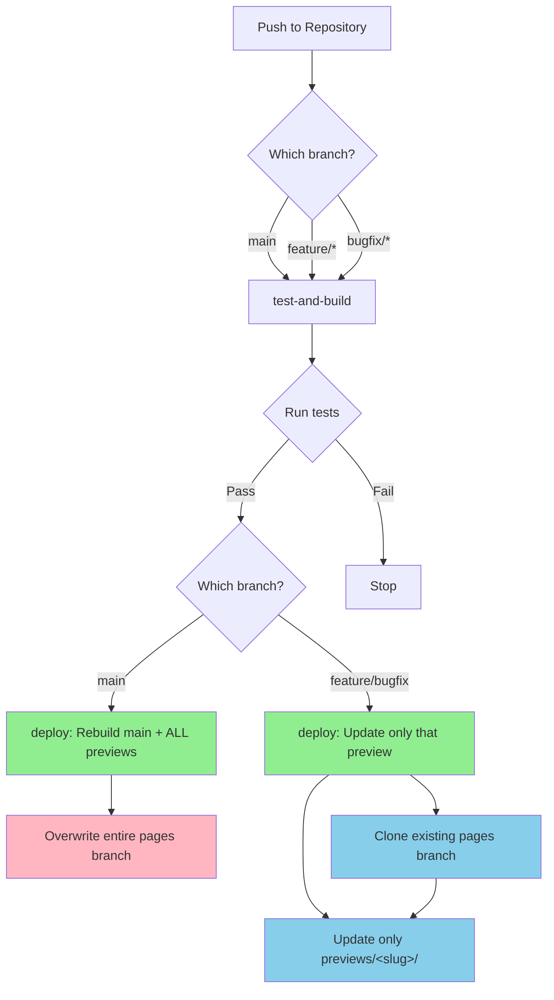

# CI/CD Pipeline

This document describes the GitHub Actions workflow for building and deploying the Parallax documentation site.

## Overview

The CI/CD pipeline handles:
- Running tests and coverage on all pushes
- Deploying the main site when `main` is updated
- Deploying preview sites for feature and bugfix branches
- Cleaning up previews when branches are deleted

## Trigger Flow



**Key behavior:**
- **Push to `main`**: Full rebuild of everything. Overwrites the entire `pages` branch (main site + all previews).
- **Push to `feature/*` or `bugfix/*`**: Only updates that specific preview. Preserves existing main site and other previews in the `pages` branch.

## Branch Structure

The `pages` branch serves as the deployment target for GitHub Pages:

```
pages branch/
├── index.html          # Main site (built from main branch)
├── assets/             # Main site assets
├── docs/               # Main site docs
├── previews/           # Feature branch previews
│   ├── feature-xxx/
│   └── bugfix-yyy/
└── .github/            # Workflow files
```

## Job Details

### test-and-build

Runs on every push to:
- `main`
- `feature/*`
- `bugfix/*`

**Steps:**
1. Setup Node.js 20
2. Install dependencies
3. Run tests and coverage
4. Build project with appropriate base path
5. Upload build artifact

**Outputs:**
- `is_main`: true if push is to main branch
- `is_preview`: true if push is to feature/bugfix branch
- `base_path`: `/parallax/` for main, `/parallax/previews/<slug>/` for previews

### deploy

Triggers on push to `main`, `feature/*`, or `bugfix/*`.

**If push to `main`:**
1. Build main site (from main branch code) with base path `/parallax/`
2. Fetch all feature/* and bugfix/* branches
3. Build each preview with base path `/parallax/previews/<slug>/`
4. Delete entire contents of `pages` branch
5. Push all builds (main site + all previews) to `pages` branch

**If push to feature/bugfix:**
1. Clone existing `pages` branch (preserves existing main site and other previews)
2. Build only the pushed branch with base path `/parallax/previews/<slug>/`
3. Copy only to `previews/<slug>/` - no changes to root or other previews
4. Push updated `pages` branch

### prune-deleted-preview

Triggers on branch deletion (via `delete` event).

**Steps:**
1. Extract branch name from deleted ref
2. Clone `pages` branch
3. Remove corresponding folder at `previews/<slug>/`
4. Push changes to `pages` branch

## Base Paths

The site is served at `https://thiagomata.github.io/parallax/`:

| Branch | Base Path | Example URL |
|--------|-----------|-------------|
| main | `/parallax/` | https://thiagomata.github.io/parallax/ |
| feature/xxx | `/parallax/previews/feature-xxx/` | https://thiagomata.github.io/parallax/previews/feature-xxx/ |
| bugfix/yyy | `/parallax/previews/bugfix-yyy/` | https://thiagomata.github.io/parallax/previews/bugfix-yyy/ |

## Concurrency

The workflow uses concurrency groups to cancel in-progress runs for the same ref:
- Push to `main` cancels any in-progress `main` runs
- Push to `feature/xxx` cancels in-progress runs for that branch

This prevents conflicts when multiple pushes happen in quick succession.