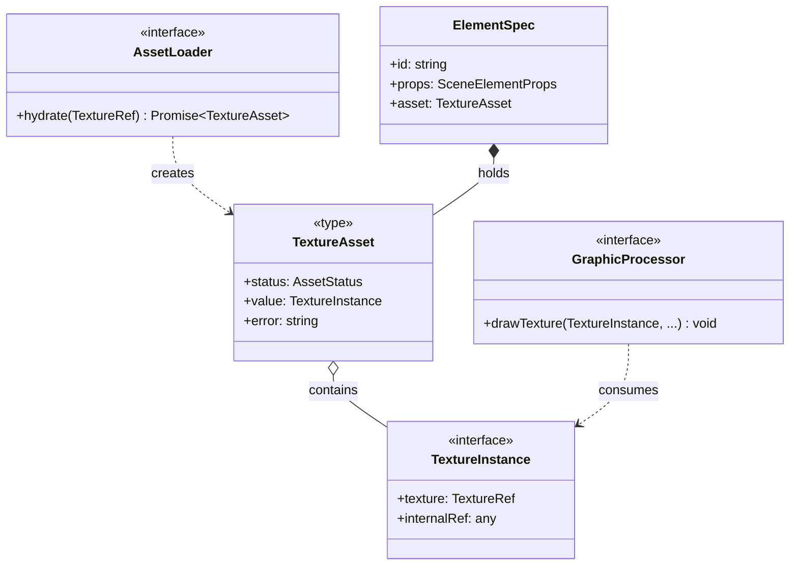
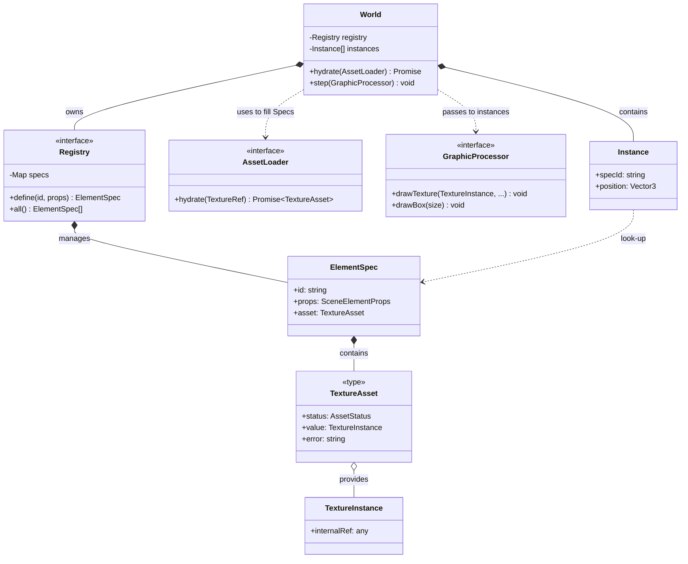

# parallax
Just me playing around with 3D and fake 3D with HTML and Javascript

## Scene Entities

```mermaid
classDiagram
    class AssetLoader {
        <<interface>>
        +hydrate(TextureRef) Promise~TextureAsset~
    }

    class TextureAsset {
        <<type>>
        +status: AssetStatus
        +value: TextureInstance
        +error: string
    }

    class TextureInstance {
        <<interface>>
        +texture: TextureRef
        +internalRef: any
    }

    class ElementSpec {
        +id: string
        +props: SceneElementProps
        +asset: TextureAsset
    }

    class GraphicProcessor {
        <<interface>>
        +drawTexture(TextureInstance, ...) void
    }

%% The Links
    AssetLoader ..> TextureAsset : creates
    ElementSpec *-- TextureAsset : holds
    TextureAsset o-- TextureInstance : contains
    GraphicProcessor ..> TextureInstance : consumes
```

```mermaid
classDiagram
    class World {
        -Registry registry
        -Instance[] instances
        +hydrate(AssetLoader) Promise
        +step(GraphicProcessor) void
    }

    class Registry {
        <<interface>>
        -Map specs
        +define(id, props) ElementSpec
        +all() ElementSpec[]
    }

    class ElementSpec {
        +id: string
        +props: SceneElementProps
        +asset: TextureAsset
    }

    class AssetLoader {
        <<interface>>
        +hydrate(TextureRef) Promise~TextureAsset~
    }

    class TextureAsset {
        <<type>>
        +status: AssetStatus
        +value: TextureInstance
        +error: string
    }

    class TextureInstance {
        +internalRef: any
    }

    class GraphicProcessor {
        <<interface>>
        +drawTexture(TextureInstance, ...) void
        +drawBox(size) void
    }

    %% Relationships & Flow
    World *-- Registry : owns
    Registry *-- ElementSpec : manages
    ElementSpec *-- TextureAsset : contains
    TextureAsset o-- TextureInstance : provides
    
    World ..> AssetLoader : uses to fill Specs
    World ..> GraphicProcessor : passes to instances
    
    class Instance {
        +specId: string
        +position: Vector3
    }
    World *-- Instance : contains
    Instance ..> ElementSpec : look-up
```