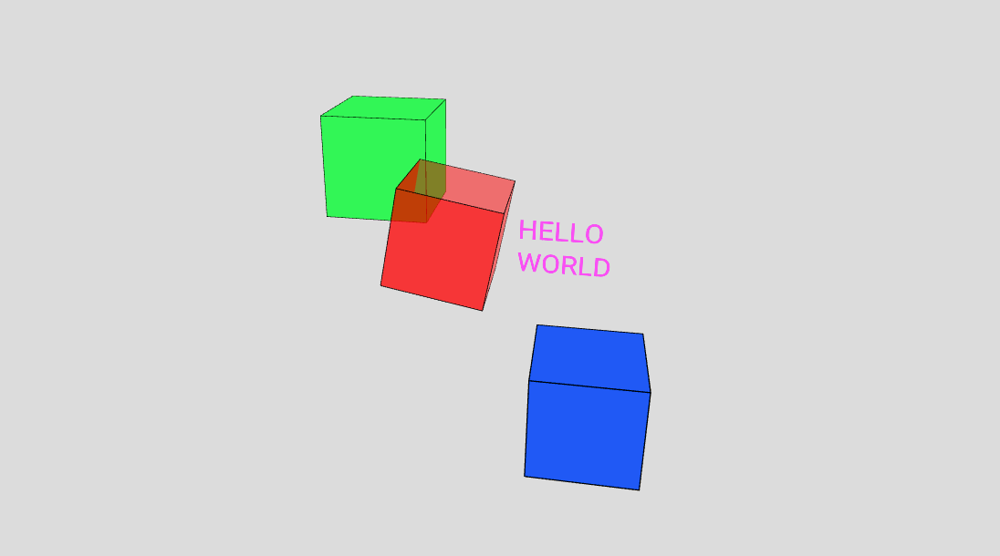
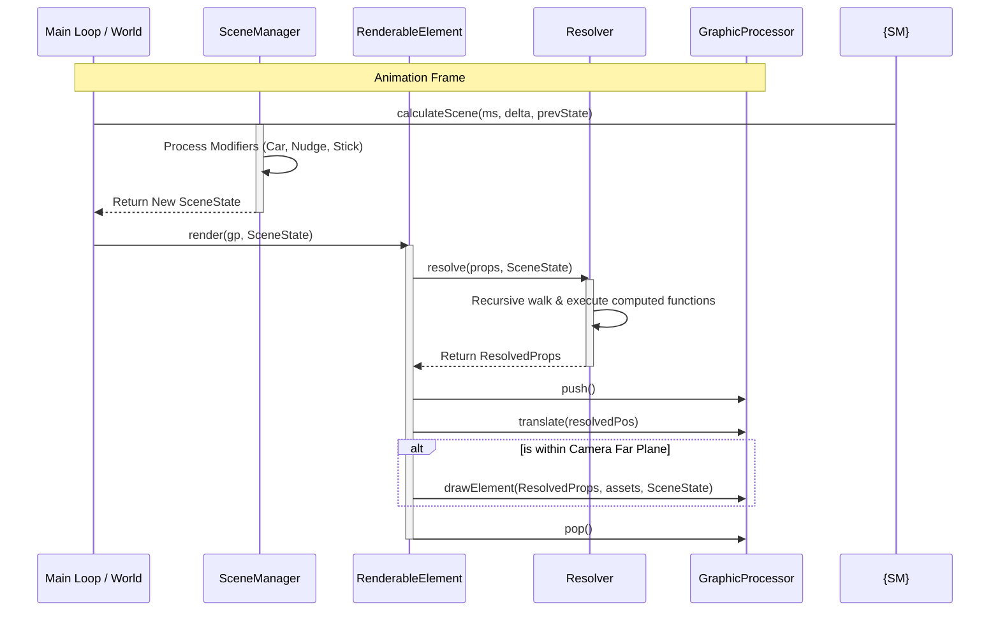
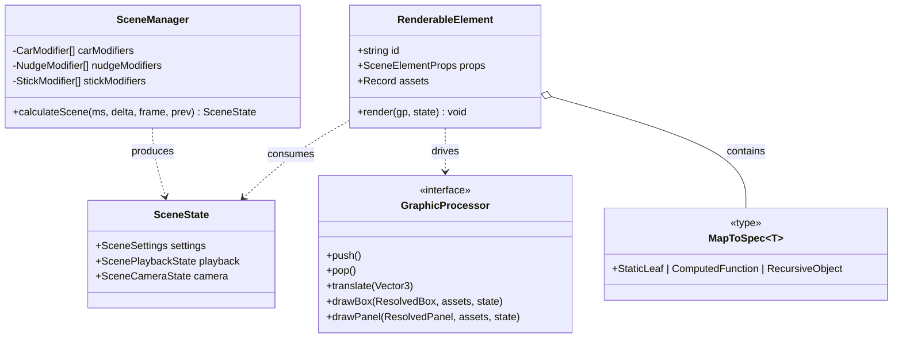

# Parallax


[](https://thiagomata.github.io/parallax/src/scene/p5/p5_world.demo.html)
[](https://thiagomata.github.io/parallax/docs/tutorial/)

# Parallax Engine

A deterministic, strictly-typed 3D state-to-state transformation engine. 
Parallax computes a unified `SceneState` through a sorted priority queue of modifiers, 
decoupling spatial intent from the rendering pipeline.



## Tutorial

Nothing like seen the magic happening!
So we created one 
[hands-on tutorial](https://thiagomata.github.io/parallax/docs/tutorial/) that allow you see and change the components
of this library.

## Core Concepts

### The Transformation Pipeline
The engine operates on a three-tier spatial model to calculate the final viewport. 
This ensures that camera motion remains smooth and frame-independent even when multiple forces—such as physics, user input, 
and procedural animation—act upon it simultaneously.

#### Car Modifiers

Determines the primary spatial anchor. Only the highest priority active "Car" controls the base position.

```typescript
// Highest priority (10) wins the base position
manager.addCarModifier({
    name: "FollowPlayer",
    priority: 10,
    active: true,
    getCarPosition: (_current, _state) => ({
        success: true,
        value: { position: playerPos, name: "player" }
    })
});
```

#### Nudge Modifiers

An additive "voting" system. Multiple nudges are averaged to create secondary motion.

```typescript
// This nudge adds a 'breathing' effect to whatever the Car decided
manager.addNudgeModifier({
    name: "Breathing",
    active: true,
    getNudge: (_base, state) => ({
        success: true,
        value: { y: Math.sin(state.playback.now * 0.002) * 15 }
    })
});
```

#### Stick Modifiers

Controls the gaze via spherical coordinates, treating the camera like a physical boom arm.

```typescript
// Force the camera to look at the center of the world
manager.addStickModifier({
    name: "LookAtCenter",
    active: true,
    priority: 1,
    getStick: (camPos) => ({
        success: true,
        value: { yaw: Math.atan2(-camPos.x, camPos.z), pitch: 0, distance: 1000, priority: 1 }
    })
});
```

### Recursive Spec Resolution
Parallax uses the Specification to Resolution system to bridge static declarations with dynamic state. 
By wrapping properties in `toProps()`, you create a property tree that resolves values at runtime.

#### Static & Computed Props

Properties can be fixed values or functions that receive the current `SceneState`.

```typescript
const props = toProps({
    type: ELEMENT_TYPES.BOX,
    position: { x: 0, y: 0, z: 0 },
    size: (s: SceneState) => 50 + (s.playback.progress * 20),
    fillColor: { red: 255, green: 0, blue: 0 }
});
```

#### Deep Resolution 

The engine handles both **Atomic** and **Granular** definitions, resolving the entire tree recursively before every render.

```typescript
    const granularProps = toProps({
        type: ELEMENT_TYPES.BOX,
        position: {
            x: (_s: SceneState) => 100, // Prefixed with _ to satisfy unused variable check
            y: 0,
            z: 0
        },
        size: 10
    });
```

### Deterministic State Management
The `SceneManager` acts as a pure state-to-state transformer. Given the same previous state and time delta, it will always produce the same result.

#### Testable & Predictable

Verify complex 3D logic and coordinate math in Node.js without a GPU.

```typescript
test('Camera should be at Y=15 after 1s of breathing', () => {
    const state = manager.calculateScene(1000, 16, 60, manager.initialState());
    expect(state.camera.position.y).toBeCloseTo(Math.sin(1000 * 0.002) * 15);
});
```

#### Agnostic

Project the resolved state onto any `GraphicProcessor` implementation.



### Multi-Renderer Support - GraphicProcessor Interface

The Parallax Engine is designed to be renderer-agnostic. 
By decoupling the scene logic from the drawing calls, 
the same `SceneState` can be projected onto any 2D or 3D graphics library.

#### Current Implementation - P5.js
The engine currently features a high-performance **P5.js** driver, taking advantage of the `P5_WEBGL` mode.

####  Architecture
All rendering logic is funneled through the `GraphicProcessor` interface. 
This allows for future implementations in **Three.js**, **PixiJS**, or even **Headless/Server-side** environments 
without changing your scene definitions.

#### The GraphicProcessor Contract

To support a new library, we only needs to implement the interface that translates resolved properties into library-specific commands:

```typescript
interface GraphicProcessor<TTexture, TFont> {
    /* Spatial Context */
    push(): void;
    pop(): void;
    translate(v: Vector3): void;
    stroke(color: ColorRGBA, weight: number = 1, globalAlpha: number = 1): void;
    fill(color: ColorRGBA, alpha: number = 1): void;
    // ...
    
    /* Primitive Rendering */
    drawBox(props: ResolvedBoxProps, assets: Record<string, TTexture>, state: SceneState): void;
    drawText(props: ResolvedTextProps, assets: Record<string, TFont>, state: SceneState): void;
    // ...
}
```

### Strict Type Safety

The engine is built to embrace the TypeScript type system. Using advanced mapped types and recursive inference, it ensures:

* **Recursive Inference:** `MapToSpec<T>` ensures that if a property is a `number`, your computed function must return a `number`.
* **Structural Preservation:** Identity keys (`type`, `texture`) are preserved as constants to provide the renderer with a stable element definition.
* **Exhaustive Resolution:** The `Resolver` guarantees that the renderer only receives flattened objects, never raw functions.


