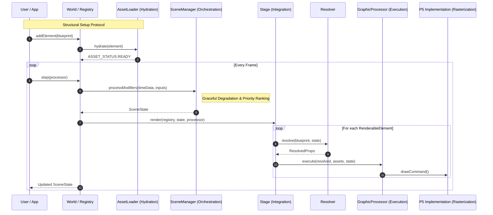
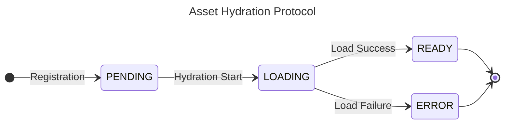

# Parallax Engine


[](https://thiagomata.github.io/parallax/)
[](https://thiagomata.github.io/parallax/docs/tutorial/)


Parallax is a **Deterministic Scene Orchestrator** designed for high-fidelity 3D interactive experiences. It operates as a strict state-to-state transformation engine, decoupling spatial intent from hardware-level rendering.

By enforcing its pipeline, Parallax enables complex cinematography—such as real-time head-tracking and reactive environments—within a predictable, traceable, and testable lifecycle.

## 🏗 The Parallax Manifest

The journey of a frame is divided into two distinct life-stages: **Structural Setup** and the **Temporal Loop**.


### I. Registration & Hydration (Setup)

**1. Registration: The Blueprint Intent**
Elements are registered as **Blueprints**. These are reactive contracts supporting deep-tree branches. A property can be a static value, a nested object, or a function `(state) => T` at any node level.

```typescript
world.addSphere({
    id: 'hero',
    type: ELEMENT_TYPES.SPHERE,
    radius: (s: SceneState) => 50 + Math.sin(s.playback.progress), // Dynamic node
    position: { x: 0, y: (s: SceneState) => s.camera.pitch * 10 } // Nested reactivity
});

```

**2. Hydration: Asset Locking**
High-memory assets (Textures/Fonts) are fetched and encapsulated into a renderer-specific **Graphics Bundle**. This ensures assets are locked to the element and ready in memory prior to the first frame.



### II. The Frame Loop - Many times per Second

**3. Modification: Graceful Degradation**
The **Modifier Stack** (`Car` → `Nudge` → `Stick`) processes raw inputs (Time, Scroll, Mouse, FaceGeometry).
This phase manages **Graceful Degradation**:
if a tracking source disconnects, modifiers transition through states like `READY` to `DRIFTING` (returning to neutral) to maintain stability.

**4. Orchestration: The Modifier Chain**
The `SceneManager` executes the **Modifier Chain**, ranking entries by `priority`.
Multiple inputs (e.g., a path-following `Car` and a head-tracking `Nudge`) are aggregated and collapsed into a single, unified, and immutable **SceneState**.

**5. Resolution: Single Source of Truth**
The `Resolver` executes the Blueprint functions using the newly calculated **SceneState**.
This transforms dynamic intent into **ResolvedProps**—a resolved, static dataset representing the frame's final geometry.

**6. Integration: The Execution Package**
The `Stage` pairs the **ResolvedProps** with their **Hydrated Assets**.
This creates a complete execution package, ensuring the renderer receives everything required (logic + assets) in a single handshake.

**7. Execution: Deterministic Transformations**
The `Stage` drives the **GraphicProcessor** interface.
Because this phase is decoupled from the hardware API, it enables **Unit Testing of the 3D scene math** without a GPU or browser environment.

```typescript
test('coordinate resolution math', () => {
    const mock = new MockProcessor();
    stage.render(world, mockState, mock);
    // Verify math results before pixels are even touched
    expect(mock.lastTranslation.x).toBe(150); 
});

```

**8. Rasterization: Hardware Translation**
The concrete implementation (e.g., `P5Processor`) converts the requests into a final image, handling hardware-level primitives, lights, and buffers.

---

## 🛠 Implementation Guardrails

To maintain the integrity of this deterministic pipeline, all development must respect these constraints:

* **Idempotent Resolution**: The `Resolver` must be a pure function. It reads `SceneState` and returns `ResolvedProps` without side effects.
* **No Redundant Data**: If a value can be computed from the `SceneState`, it must not be stored in the element. Follow the **Single Source of Truth** principle strictly.
* **Priority-Based Chaining**: Higher priority modifiers in the **Orchestration** phase always layer over or override lower-priority results.
* **Renderer Agnosticism**: The **Execution** phase must remain pure logic. Hardware-specific calls are strictly forbidden until the **Rasterization** phase.
