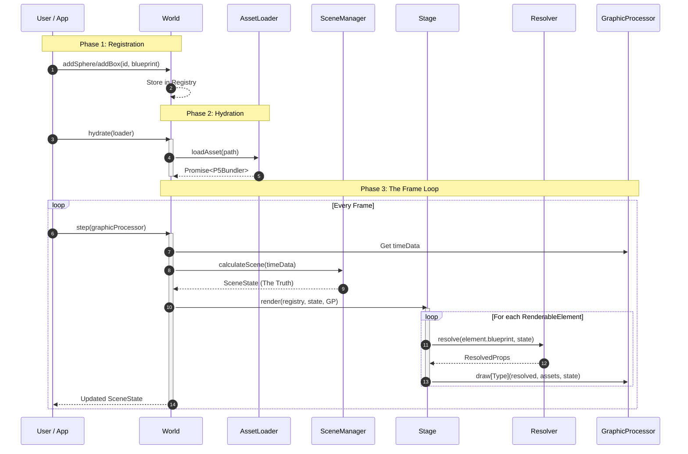

# Parallax Engine


[](https://thiagomata.github.io/parallax/)
[](https://thiagomata.github.io/parallax/docs/tutorial/)

A deterministic, strictly-typed 3D state-to-state transformation engine. Parallax computes a unified `SceneState` through a sorted priority queue of modifiers, decoupling spatial intent from the rendering pipeline via a Bridge Pattern.


## The Parallax Manifest

Every line of code in the engine follows four core phases to ensure **Single Source of Truth** and **Deterministic Rendering**:

1.  **Registration**: Blueprints are stored in the Registry. They contain static values or `(state) => T` functions.
2.  **Hydration**: Assets (Textures/Fonts) are loaded into a `P5Bundler` and locked to the element.
3.  **Resolution**: The `Resolver` surgically executes blueprint functions using the current `SceneState`.
4.  **Execution**: The `Stage` drives the `GraphicProcessor` using flattened, resolved data.

## Core Concepts

### 1. Surgical Resolution
Parallax avoids data redundancy by keeping the `blueprint` as the only source of truth. The `Resolver` transforms these blueprints into "Solid Data" (ResolvedProps) only when needed for a frame.

```typescript
// Registration: Defining intent
world.addSphere('hero', {
    type: ELEMENT_TYPES.SPHERE,
    position: (s: SceneState) => ({
        x: Math.sin(s.playback.progress * Math.PI * 2) * 100,
        y: 0,
        z: -200
    }),
    radius: 40,
    fillColor: { 
        red: 255, 
        blue: (s: SceneState) => 127 + 127 * Math.sin(s.playback.progress * Math.PI) 
    }
});

```

### 2. The Bridge Pattern (GraphicProcessor)

The engine is renderer-agnostic. The `Stage` iterates through elements and instructs a `GraphicProcessor` how to draw them. This allows the same logic to drive P5.js, Three.js, or a Headless unit.

```typescript
interface GraphicProcessor<TBundler> {
    push(): void;
    pop(): void;
    translate(v: Vector3): void;
    drawSphere(props: ResolvedSphere, assets: ElementAssets<TBundler>, state: SceneState): void;
    // ...
}

```

### 3. Transformation Pipeline

The `SceneManager` calculates the camera and global environment using a three-tier spatial model:

* **Car Modifiers**: Primary spatial anchors (Follow Player).
* **Nudge Modifiers**: Additive "voting" (Camera Shake/Breathing).
* **Stick Modifiers**: Spherical gaze control (LookAt Logic).

---

## Architectural Flow



## Implementation Guardrails

* **No Side-Effects in Resolution**: The Resolver must be a pure function.
* **Respect the Type System**: No `any` casting; use the generated `ResolvedProps` types.
* **Single Source of Truth**: Dynamic properties live only in the blueprint until the moment of render.