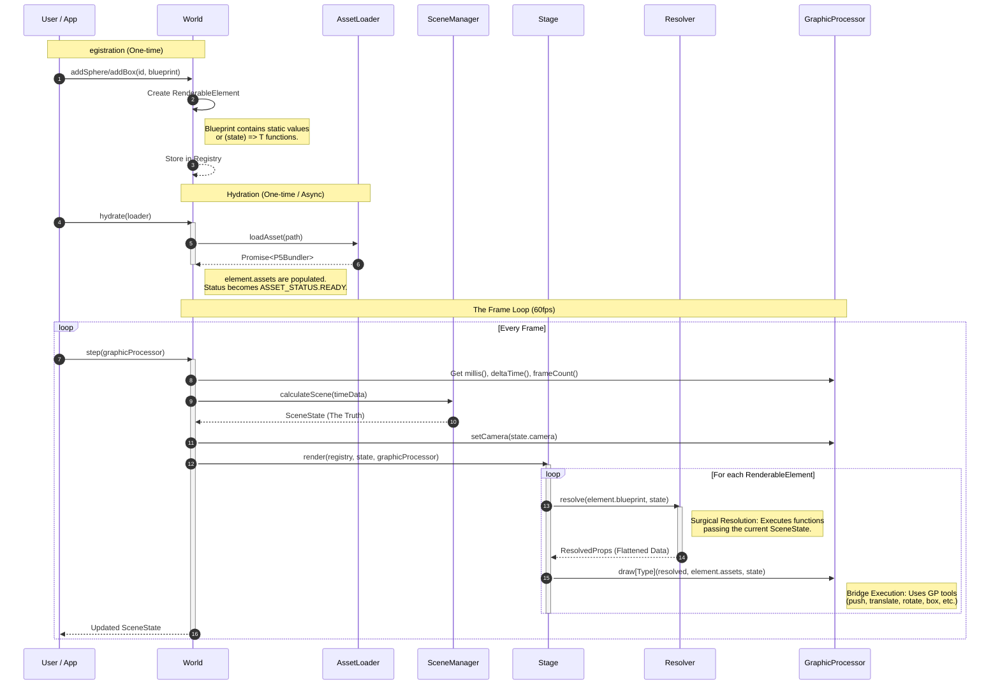

```mermaid
sequenceDiagram
    autonumber
    participant U as User / App
    participant W as World
    participant L as AssetLoader
    participant SM as SceneManager
    participant S as Stage
    participant R as Resolver
    participant GP as GraphicProcessor

    Note over U,W: egistration (One-time)
    U->>W: addSphere/addBox(id, blueprint)
    W->>W: Create RenderableElement
    Note right of W: Blueprint contains static values<br/>or (state) => T functions.
    W-->>W: Store in Registry

    Note over W,L: Hydration (One-time / Async)
    U->>W: hydrate(loader)
    activate W
    W->>L: loadAsset(path)
    L-->>W: Promise<P5Bundler>
    deactivate W
    Note right of W: element.assets are populated.<br/>Status becomes ASSET_STATUS.READY.

    Note over W,GP: The Frame Loop (60fps)
    loop Every Frame
        U->>W: step(graphicProcessor)
        activate W

        W->>GP: Get millis(), deltaTime(), frameCount()
        W->>SM: calculateScene(timeData)
        SM-->>W: SceneState (The Truth)

        W->>GP: setCamera(state.camera)

        W->>S: render(registry, state, graphicProcessor)
        activate S

        loop For each RenderableElement
            S->>R: resolve(element.blueprint, state)
            activate R
            Note right of R: Surgical Resolution: Executes functions<br/>passing the current SceneState.
            R-->>S: ResolvedProps (Flattened Data)
            deactivate R

            S->>GP: draw[Type](resolved, element.assets, state)
            Note right of GP: Bridge Execution: Uses GP tools<br/>(push, translate, rotate, box, etc.)
        end
        deactivate S

        W-->>U: Updated SceneState
        deactivate W
    end
```