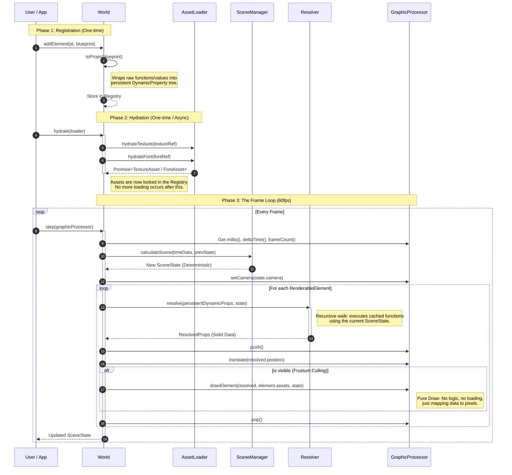

```mermaid
sequenceDiagram
    autonumber
    participant U as User / App
    participant W as World
    participant L as AssetLoader
    participant SM as SceneManager
    participant R as Resolver
    participant GP as GraphicProcessor

    Note over U, W: Phase 1: Registration (One-time)
    U->>W: addElement(id, blueprint)
    W->>W: toProps(blueprint)
    Note right of W: Wraps raw functions/values into<br/>persistent DynamicProperty tree.
    W-->>W: Store in Registry

    Note over W, L: Phase 2: Hydration (One-time / Async)
    U->>W: hydrate(loader)
    activate W
    W->>L: hydrateTexture(textureRef)
    W->>L: hydrateFont(fontRef)
    L-->>W: Promise<TextureAsset / FontAsset>
    deactivate W
    Note right of W: Assets are now locked in the Registry.<br/>No more loading occurs after this.

    Note over W, GP: Phase 3: The Frame Loop (60fps)
    loop Every Frame
        U->>W: step(graphicProcessor)
        activate W
        
        W->>GP: Get millis(), deltaTime(), frameCount()
        W->>SM: calculateScene(timeData, prevState)
        SM-->>W: New SceneState (Deterministic)
        
        W->>GP: setCamera(state.camera)

        loop For each RenderableElement
            W->>R: resolve(persistentDynamicProps, state)
            activate R
            Note right of R: Recursive walk: executes cached functions<br/>using the current SceneState.
            R-->>W: ResolvedProps (Solid Data)
            deactivate R

            W->>GP: push()
            W->>GP: translate(resolved.position)
            
            alt is visible (Frustum Culling)
                W->>GP: drawElement(resolved, element.assets, state)
                Note right of GP: Pure Draw: No logic, no loading,<br/>just mapping data to pixels.
            end
            
            W->>GP: pop()
        end
        
        W-->>U: Updated SceneState
        deactivate W
    end
```