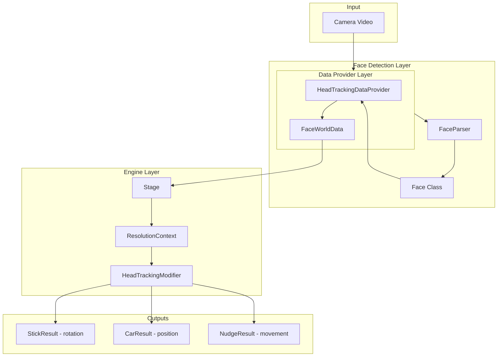
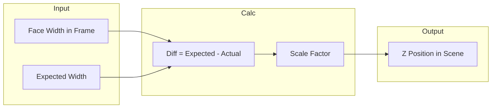
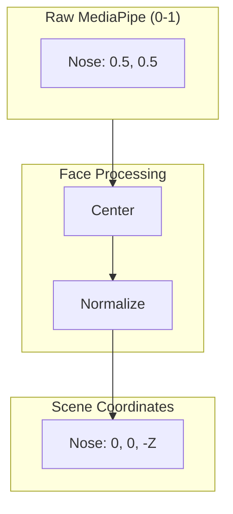

# Head Tracking System

This document describes the head tracking architecture in Parallax, including how data flows from the camera to the scene, and how to use the system.

## Overview

The head tracking system converts camera video into 3D head position and rotation data that drives the Parallax engine. It uses MediaPipe for face landmark detection and transforms the raw data into scene coordinates.



## Architecture Layers

### 1. Detection Layer

**Purpose:** Convert raw video into semantic face data

| Class | File | Responsibility |
|-------|------|-----------------|
| `MediaPipeFaceProvider` | `drivers/mediapipe/face_provider.ts` | Video capture, MediaPipe WASM loading, landmark detection |
| `FaceParser` | `drivers/mediapipe/face_parser.ts` | Maps 478 MediaPipe landmarks to semantic landmarks (eyes, nose, ears, etc.) |
| `Face` | `drivers/mediapipe/face.ts` | Pure computation: normalization, rotation extraction, feature access |

### 2. Data Provider Layer

**Purpose:** Transform face data into scene coordinates

| Class | File | Responsibility |
|-------|------|-----------------|
| `HeadTrackingDataProvider` | `providers/head_tracking_data_provider.ts` | Converts Face to scene coordinates, computes Z-depth from head size |
| `FaceWorldData` | `providers/head_tracking_data_provider.ts` | Container with transformed coordinates + rotation data |

### 3. Engine Layer

**Purpose:** Integrate with Parallax engine via modifiers

| Class | File | Responsibility |
|-------|------|-----------------|
| `HeadTrackingModifier` | `modifiers/head_tracking_modifier.ts` | Converts FaceWorldData to engine outputs (Stick, Car, Nudge) |
| `Stage` | `stage.ts` | Manages data providers, builds ResolutionContext |

## Usage

### 1. Basic Setup with Stage

```typescript
import { Stage } from './stage.ts';
import { HeadTrackingDataProvider } from './providers/head_tracking_data_provider.ts';
import type { HeadTrackerDataProviderLib } from './providers/head_tracking_data_provider.ts';

// Define your data provider library type
type MySceneLib = HeadTrackerDataProviderLib;

// Create stage with typed data providers
const stage = new Stage<any, any, any, MySceneLib>(settings, loader);

// Create and add the head tracking data provider
const headTracker = new HeadTrackingDataProvider(p5, 120, 650);
stage.addDataProvider('headTracker', headTracker);

// Initialize (loads MediaPipe)
await headTracker.init();
```

### 2. Using in Projections

```typescript
import { HeadTrackingModifier } from './modifiers/head_tracking_modifier.ts';

const myProjection = {
    id: 'my-projection',
    modifiers: {
        stickModifiers: [new HeadTrackingModifier()],
        carModifiers: [new HeadTrackingModifier()],
    }
};
```

### 3. Custom Configuration

```typescript
const modifier = new HeadTrackingModifier({
    travelRange: 150,      // X/Y movement range in scene units
    damping: 0.6,          // Rotation intensity reduction (0-1)
    lookDistance: 800,     // Camera distance for stick rotation
    zTravelRange: 600,     // Z depth movement range
});
```

## How It Works

### Z-Depth Calculation

The system determines how far the user is from the camera by measuring the face size:



1. **Measure face width** in the video frame
2. **Compare** to expected width (calibrated neutral position)
3. **Calculate difference** - larger face = closer, smaller face = farther
4. **Map to scene Z** - controls how "deep" the head appears in 3D

### Rotation Extraction

The `Face` class computes yaw, pitch, and roll from facial landmarks:

```typescript
// From Face class
const rotation = face.getRotation();
// Returns: { yaw, pitch, roll } in radians
```

- **Yaw** - Head turn left/right (computed from nose position relative to eye center)
- **Pitch** - Head tilt up/down (computed from nose position relative to face center)
- **Roll** - Head tilt side-to-side (computed from eye line angle)

### Coordinate Transformation

Raw MediaPipe coordinates (0-1 normalized) are transformed to scene coordinates:



## Explicit Dependencies

Modifiers declare their data provider dependencies explicitly:

```typescript
// In HeadTrackingModifier
export class HeadTrackingModifier<TDataProviderLib extends DataProviderLib = HeadTrackerDataProviderLib>
    implements StickModifier<TDataProviderLib>, CarModifier<TDataProviderLib>, NudgeModifier<TDataProviderLib> {
    
    // This tells the system we need 'headTracker' in the data providers
    readonly requiredDataProviders: (keyof TDataProviderLib)[] = ['headTracker'];
}
```

This ensures:
- **Compile-time safety** - TypeScript errors if `headTracker` isn't registered
- **Explicit contracts** - Dependencies are visible in the type system
- **No hidden coupling** - No constructor injection needed

## Data Types

### FaceWorldData

Output from `HeadTrackingDataProvider`:

```typescript
interface FaceWorldData {
    face: Face;                    // The raw Face object
    sceneHeadWidth: number;        // Configured head width in scene units
    midpoint: Vector3;             // Head position in scene coordinates
    
    // Transformed features (scene coordinates)
    nose: Vector3;
    eyes: { left: Vector3; right: Vector3; };
    brows: { left: Vector3; right: Vector3; };
    bounds: { left: Vector3; right: Vector3; top: Vector3; bottom: Vector3; };
    
    // Rotation (radians)
    stick: { yaw: number; pitch: number; roll: number; };
}
```

### StickResult

Output from modifier's `getStick()`:

```typescript
interface StickResult {
    yaw: number;      // Radians
    pitch: number;    // Radians
    roll: number;     // Radians
    distance: number; // Scene units
    priority: number; // Modifier priority
}
```

### CarResult

Output from modifier's `getCarPosition()`:

```typescript
interface CarResult {
    name: string;
    position: Vector3;  // Scene coordinates (x, y, z)
}
```

## Configuration Reference

### HeadTrackingDataProvider

| Parameter | Default | Description |
|-----------|---------|-------------|
| `sceneHeadWidth` | 120 | Expected head width in scene units |
| `sceneScreenWidth` | 650 | Screen/camera width in scene units |
| `mirror` | false | Whether to mirror the video |
| `panelPosition` | {x:0, y:0, z:0} | Panel position in scene |
| `cameraPosition` | {x:0, y:0, z:300} | Camera position in scene |

### HeadTrackingModifier

| Parameter | Default | Description |
|-----------|---------|-------------|
| `travelRange` | 100 | X/Y position range in scene units |
| `damping` | 0.5 | Rotation intensity multiplier (0-1) |
| `lookDistance` | 1000 | Camera distance for stick |
| `zTravelRange` | 500 | Z depth movement range |

## Troubleshooting

### Face not detected

1. Check camera permissions
2. Ensure adequate lighting
3. Verify face is within frame (not too close/far)
4. Check MediaPipe model loaded correctly

### Head movement feels reversed

Adjust the `damping` parameter - negative values can invert the direction.

### Face grows/shrinks unexpectedly

This usually indicates the Z-depth calculation needs tuning. Adjust `sceneHeadWidth` to match your expected viewing distance.

## Files Reference


| File                                                                                 | Purpose                    |
| ------------------------------------------------------------------------------------ | -------------------------- |
| [drivers/mediapipe/face_provider.ts](drivers/mediapipe/face_provider.ts)             | Video capture & detection  |
| [drivers/mediapipe/face_parser.ts](drivers/mediapipe/face_parser.ts)                 | Landmark mapping           |
| [drivers/mediapipe/face.ts](drivers/mediapipe/face.ts)                               | Face computation           |
| [providers/head_tracking_data_provider.ts](providers/head_tracking_data_provider.ts) | Scene coordinate transform |
| [modifiers/head_tracking_modifier.ts](modifiers/head_tracking_modifier.ts)           | Engine integration         |
| [types.ts](types.ts)                                                                 | Modifier interfaces        |
| [stage.ts](stage.ts)                                                                 | Orchestration              |
